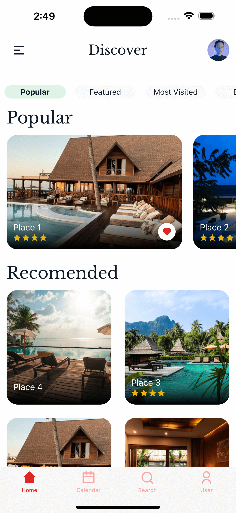
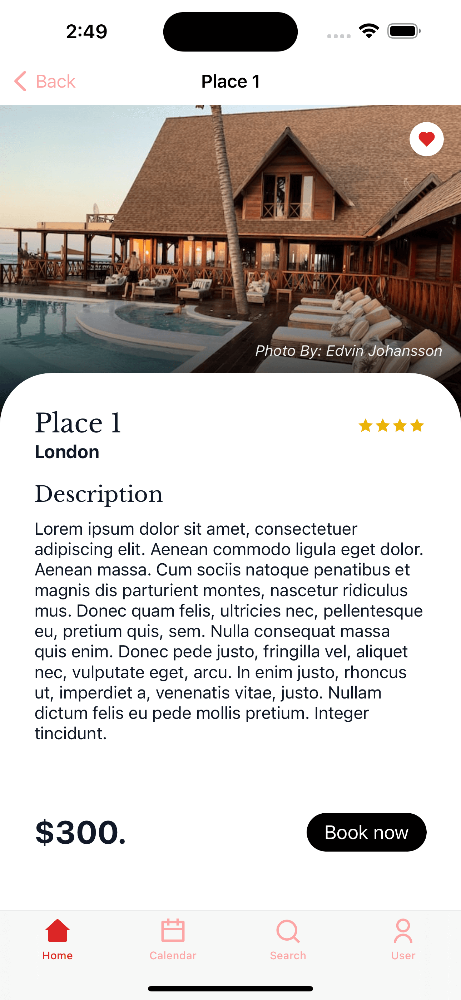

# Holiday Demo App - PurgeTSS Version

This [**Titanium App**](https://titaniumsdk.com) is a cross-platform mobile application for iOS and Android that was created using [**PurgeTSS**](https://purgetss.com).

This is a re-creation of Michael's [**Holiday Demo App**](https://github.com/m1ga/demo_app_holiday).. So the design and creative properties goes to him!!

## Features

- **Widgets**: Our app makes extensive use of the `Widgets` to create and manage various interactive elements.

- **Backbone Collections**: We've integrated Backbone Collections into our app, to simulate Dynamic content and ensure seamless data handling and organization.

- **TiKit Library**: We've incorporated the [TiKit UI Components](https://purgetss.com/tikit). This library offers a rich set of UI components, including Tabs with Icon Fonts.

- **RemixIcon**: We've used [RemixIcon](https://github.com/Remix-Design/RemixIcon) to provide a set of icon fonts.

## Getting Started

First, make sure you have **PurgeTSS** installed globally on your machine:

```bash
> npm i -g purgetss
```

To get started with this Sample App, follow these steps:

1. Clone this repository to your local machine:

   ```shell
   git clone git@github.com:macCesar/holiday-demo-purgetss-version.git
   ```

1. Open the project in your preferred code editor or IDE.

2. Run the app on your simulator or device to test it.


## Content
The App uses TabGroups and Alloy Widgets, just like Michael's example.

To '*parse*' Widgets in **PurgeTSS**, set the `widgets` option to true in `config.js`.

```javascript
// ./purgetss/config.js
module.exports = {
  purge: {
    options: {
      widgets: true, // Parse Widgets
    }
  }
};
```

### Data Collections
This app is using Backbone Collections to simulate Dynamic content.





## Contributing

If you'd like to contribute to this Sample App or have suggestions for improvements, please feel free to open an issue or submit a pull request.

## License

This Sample App is open-source and available under the [MIT License](LICENSE).
